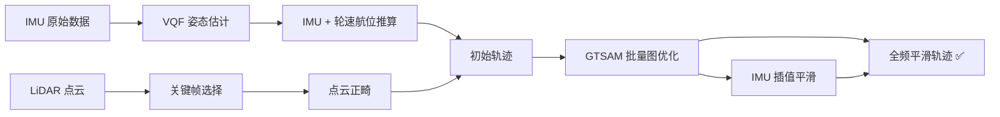

# GT Pose Batch Optimization

位姿批量优化流水线，用于融合 IMU、轮速计与 LiDAR 传感器数据，通过 VQF 姿态估计、航位推算、GTSAM 图优化等步骤，输出高精度的全局轨迹与点云地图。

---

## 1. 原理概述

### 1.1 问题背景

在自动驾驶或机器人定位中，单一传感器存在固有缺陷：
- **IMU**：可高频输出姿态，但积分后漂移严重，位置误差随时间累积
- **轮速计**：可提供车辆前进速度，但受打滑影响
- **LiDAR**：点云匹配可提供精确的空间约束，但依赖初始位姿

因此需要**多传感器融合**，取长补短，得到全局一致的高精度轨迹。

### 1.2 核心技术路线



---

## 2. 算法流程

### 步骤 0：IMU 数据格式转换 (`transform_imu_format.py`)

将原始 IMU 数据转换为统一格式输出到 `imu0.txt`，方便后续流程使用。

### 步骤 1：从 Rosbag 提取传感器数据 (`extract_sensor_data.py`)

从 car rosbag 中提取轮速、GPS 等数据，保存到 `wheel_velocity.txt`。

同时获取 LiDAR 和 Camera 的时间戳文件。

### 步骤 2：VQF 姿态估计 (`vqf_att_offline_estimate.py`)

**原理**：VQF（Vector Quaternion Filter）是一种基于 IMU 加速度计与陀螺仪数据融合的离线姿态估计算法。

**算法**：
1. 利用加速度计测量值估计重力方向，获取 Roll 和 Pitch
2. 利用陀螺仪积分角速度，估计航向变化
3. 使用互补滤波或四元数更新，融合得到高频姿态四元数
4. 批量离线处理，不依赖磁力计（使用 6D 融合 `quat6D`）

**输出**：TUM 格式文件（timestamp x y z qx qy qz qw），位置 x/y/z 默认为 0，姿态由四元数决定。

### 步骤 3：格式转换 TUM → ATT (`convert_tum_to_att.py`)

将 VQF 的 TUM 格式输出转换为 ATT 格式，供后续步骤使用。

### 步骤 4：四元数替换 (`replace_imu_quat.py`)

将原始 IMU 数据中的四元数替换为 VQF 估计的优化姿态，生成 `imu0_replaced.txt`（保留了原始 IMU 的加速度和角速度）。

### 步骤 5：IMU + 轮速航位推算 (`imu_dead_reckoning.py`)

**原理**：基于完整外参模型的运动学递推。

**坐标系定义**：
- 世界坐标系 **W**
- 车体系（轮速测量系）**V**
- IMU 坐标系 **I**

**外参**：
- `R_I^V`：IMU 相对车体系的旋转外参（欧拉角）
- `p_I^V`：IMU 在车体系下的杆臂位置

**算法流程**（每帧）：

```
1. 获取IMU姿态 R_I^W（由四元数得到）
2. 计算车体姿态：R_V^W = R_I^W · (R_I^V)^T
3. 将IMU角速度转到车体系：ω_V^V = (R_I^V)^T · ω_I^I
4. 从轮速得到车体前进速度 v_wheel
5. 补偿杆臂效应：v_I^V = [v_wheel, 0, 0] + ω_V^V × p_I^V
6. 转到世界系：v_I^W = R_V^W · v_I^V
7. 位置积分：p_I^W(k) = p_I^W(k-1) + v_I^W · Δt
```

**输出**：`imu0_pose.txt`（TUM 格式），包含全频 IMU 位置和姿态。

### 步骤 6：关键帧选择 (`select_keyframe.py`)

**目的**：从全部 IMU 帧中筛选出适合进行点云匹配的稀疏关键帧。

**选择条件**（满足任一即选为关键帧）：
| 条件 | 阈值 | 说明 |
|------|------|------|
| 时间间隔 | > 10s | 长时间无更新 |
| 平移距离 | > 10m | 位置显著变化 |
| 偏航角变化 | > 15° | 方向显著变化 |
| 横滚/俯仰角变化 | > 1.0° | 车身姿态显著倾斜 |

同时要求 LiDAR 与 Camera 时间差 ≤ 同步阈值，保证多传感器数据同步。

**输出**：关键帧对应表（LiDAR 时间戳 → Camera 时间戳）。

### 步骤 7：点云正畸 (`pointcloud_deskew.py`)

**问题**：LiDAR 扫描一帧需要时间（如 100ms），扫描过程中车辆已有运动，直接拼接会导致点云畸变（拉伸/压缩）。

**原理**：运动补偿（Motion Compensation）。

**算法**：
1. 按点云的 curvature（相对于帧起始点的时间偏移）分 batch（默认 1ms 一个 batch）
2. 对每个 batch：
   - 插值该 batch 对应时刻的位姿 `T(point_time)`
   - 插值目标时刻位姿 `T(target_time)`
   - 将点从 LiDAR 坐标系 → 世界坐标系 → 目标时刻坐标系

$$
p_{\text{corrected}} = (R_{\text{target}})^{-1} \cdot (p_{\text{world}} - t_{\text{target}})
$$

其中：

$$
p_{\text{world}} = R_{\text{point}} \cdot p_{\text{lidar}} + t_{\text{point}}
$$

**输出**：矫正后的关键帧点云（PLY 格式）+ 对应目标位姿（`target_pose.txt`，TUM 格式）。

### 步骤 8：GTSAM 批量图优化 (`gtsam_pose_optimization.py`)

**核心算法**：基于因子图（Factor Graph）的非线性最小二乘优化。

#### 8.1 因子图构建

优化变量：关键帧位姿节点 `X(i) = Pose3`

**约束（因子）**：

1. **先验因子（Prior Factor）**
   - 对第一个位姿施加绝对先验（Sigma 极小，固定起点）
   - 代码：`gtsam.PriorFactorPose3(X(0), pose_0, sigmas=[1e-6]*6)`

2. **里程计因子（Between Factor）**
   - 相邻关键帧之间的相对位姿约束
   - 来自航位推算轨迹的初值
   - 噪声模型：`[0.05, 0.05, 0.2, 2.0, 2.0, 0.5]`（roll, pitch, yaw, x, y, z 的标准差）

3. **水平姿态因子（Pose3AttitudeFactor）**
   - 约束 Roll 和 Pitch 接近初值，锁定水平面
   - 假设地面水平，使用 `Unit3(0,0,1)` 法向量约束
   - 噪声：`[0.01, 0.01]`（水平方向）

4. **点到面约束（CustomFactor — Point-to-Plane）**
   - **核心 ICP 匹配约束**
   - 对当前帧点云中的每个特征点，在前一帧点云中找到最近的匹配面
   - 约束：该点经过当前帧 → 前一帧的坐标变换后，应落在匹配面的法向量上
   - 使用 Huber 鲁棒核函数处理离群点
   - 残差函数：
     ```
     e = n^T · p' - d
     其中：
       p' = T_rel · p_curr         （当前点转到前一帧坐标系）
       T_rel = pose_prev^(-1) · pose_curr
       n^T · p' = d                 （点应在平面上）
     ```

#### 8.2 优化求解

使用 **Levenberg-Marquardt**（L-M）算法求解非线性最小二乘问题：

$$
\min_{\mathbf{x}} \sum_i \| r_i(\mathbf{x}) \|^2
$$

- 最多迭代 20 次
- 迭代终止条件由 GTSAM 默认收敛判断

**输出**：`gtsam_pose.txt`，关键帧优化后的位姿。

### 步骤 9：IMU 轨迹插值平滑 (`smooth_imu_pose.py`)

**目的**：将稀疏的关键帧优化结果插值回全频 IMU 帧，输出平滑完整轨迹。

**方法**：基于因子图的全局平滑，而非简单插值。

**约束**：
- **关键帧先验因子**：关键帧时刻严格对齐 GTSAM 优化结果
- **里程计因子**：相邻 IMU 帧之间施加相对运动约束

**动态噪声机制**：
- 基础噪声 sigma = `[1e-4, 1e-4, 1e-4, 1e-3, 1e-3, 1e-3]`
- 实际噪声 = `base_sigma * dt`（与时间间隔成正比）
- 效果：时间间隔越小，权重越大，轨迹越刚性；间隔越大，允许更多平滑

**输出**：`all_imu_smooth.txt`，全频平滑轨迹。

### 步骤 10：点云地图生成与投影检查

- **`generate_map.py`**：将所有矫正后的关键帧点云按优化后的位姿拼接，生成全局点云地图 `opt_map.pcd`
- **`check_project_err.py`**：将优化后的点云地图重投影到相机图像上，进行可视化验证

---

## 3. 模块总览

| 模块 | 输入 | 输出 | 核心方法 |
|------|------|------|---------|
| `transform_imu_format.py` | 原始 IMU | imu0.txt | 格式转换 |
| `extract_sensor_data.py` | Rosbag | wheel_velocity.txt | Rosbag 解析 |
| `vqf_att_offline_estimate.py` | IMU 原始数据 | VQF 四元数 | VQF 6D 融合 |
| `convert_tum_to_att.py` | TUM 格式 | ATT 格式 | 格式转换 |
| `replace_imu_quat.py` | IMU + VQF 姿态 | 替换后 IMU | 四元数替换 |
| `imu_dead_reckoning.py` | IMU + 轮速 | imu0_pose.txt | 运动学递推 + 杆臂补偿 |
| `select_keyframe.py` | IMU pose + lidar/cam ts | 关键帧列表 | 位移/角度阈值选择 |
| `pointcloud_deskew.py` | 点云 + 位姿 | 矫正点云 | 分 batch 运动补偿 |
| `gtsam_pose_optimization.py` | 初始轨迹 + 点云 | gtsam_pose.txt | 因子图优化 |
| `smooth_imu_pose.py` | 全频 IMU + 关键帧优化结果 | all_imu_smooth.txt | GTSAM 插值平滑 |
| `generate_map.py` | 矫正点云 + 优化位姿 | opt_map.pcd | 点云拼接 |

---

## 4. 数据流图

> **高保真交互版本**：[dataflow_diagram.html](./dataflow_diagram.html)（可缩放、拖拽，适合本地浏览）
>
> GitHub / GitLab 上阅读时使用下方内置 Mermaid 图：

```mermaid
flowchart LR
    subgraph S1["阶段一 · 数据提取"]
        A1["Rosbag"] --> A2["extract_sensor_data.py"]
        A2 --> A3["wheel_velocity.txt"]
        A2 --> A4["get_files_timestamps.py"]
        A4 --> A5["lid_timestamps.txt"]
        A4 --> A6["cam_timestamps.txt"]
        A7["原始IMU"] --> A8["transform_imu_format.py"]
        A8 --> A9["imu0.txt"]
    end

    subgraph S2["阶段二 · 姿态估计"]
        A9 --> B1["vqf_att_offline_estimate.py"]
        B1 --> B2["imu0_vqf.txt"]
        B2 --> B3["convert_tum_to_att.py"]
        B3 --> B4["imu0_att.txt"]
        B4 --> B5["replace_imu_quat.py"]
        B5 --> B6["imu0_replaced.txt"]
    end

    subgraph S3["阶段三 · 航位推算"]
        A3 --> C1["imu_dead_reckoning.py"]
        B6 --> C1
        C1 --> C2["imu0_pose.txt"]
    end

    subgraph S4["阶段四 · 关键帧 & 点云"]
        A5 --> D1["select_keyframe.py"]
        A6 --> D1
        C2 --> D1
        D1 --> D2["keyframes.txt"]
        D1 --> D3["pointcloud_deskew.py"]
        C2 --> D3
        D3 --> D4["deskew_pcd/"]
        D3 --> D5["target_pose.txt"]
    end

    subgraph S5["阶段五 · GTSAM 优化"]
        D4 --> E1["gtsam_pose_optimization.py"]
        E1 --> E2["gtsam_pose.txt"]
    end

    subgraph S6["阶段六 · 后处理"]
        C2 --> F1["smooth_imu_pose.py"]
        E2 --> F1
        F1 --> F2["all_imu_smooth.txt ✅"]
        E2 --> F3["generate_map.py"]
        D4 --> F3
        F3 --> F4["opt_map.pcd"]
        E2 --> F5["check_project_err.py"]
        F5 --> F6["reproject_check/"]
    end
```



### 4.1 各阶段 IO 关系

| 阶段 | 核心模块 | 主要输入 | 主要输出 | 下游消费者 |
|------|---------|---------|---------|-----------|
| 数据提取 | `extract_sensor_data.py` | Rosbag | wheel_velocity.txt, lid/cam 时间戳 | 航位推算、关键帧选择 |
| 姿态估计 | `vqf_att_offline_estimate.py` | IMU 原始数据 | 四元数姿态序列 | 航位推算 |
| 航位推算 | `imu_dead_reckoning.py` | IMU姿态 + 轮速 | imu0_pose.txt（全频初值） | 关键帧选择、点云正畸、全频平滑 |
| 关键帧选择 | `select_keyframe.py` | IMU pose + 时间戳 | keyframes.txt | 点云正畸 |
| 点云正畸 | `pointcloud_deskew.py` | 原始点云 + imu0_pose | deskew_pcd/ + target_pose.txt | GTSAM优化、地图生成 |
| GTSAM优化 | `gtsam_pose_optimization.py` | 初始轨迹 + 点云 | gtsam_pose.txt（关键帧优化） | 全频平滑、地图生成、重投影 |
| 全频平滑 | `smooth_imu_pose.py` | imu0_pose + gtsam_pose | all_imu_smooth.txt | — |
| 地图生成 | `generate_map.py` | 矫正点云 + gtsam_pose | opt_map.pcd | 重投影验证 |
| 重投影验证 | `check_project_err.py` | gtsam_pose + 点云 | reproject_check/ | — |

---

## 5. 关键参数说明

### 5.1 外参参数

| 参数 | 默认值 | 说明 |
|------|--------|------|
| `--ext-rot-roll` | 0.0 rad | IMU 相对车体的 roll 安装角 |
| `--ext-rot-pitch` | 0.0 rad | IMU 相对车体的 pitch 安装角 |
| `--ext-rot-yaw` | 0.0 rad | IMU 相对车体的 yaw 安装角 |
| `--ext-pos-x` | 1.2 m | IMU 在车体系下的 x 位置 |
| `--ext-pos-y` | 0.0 m | IMU 在车体系下的 y 位置 |
| `--ext-pos-z` | 0.8 m | IMU 在车体系下的 z 位置 |

### 5.2 关键帧选择阈值

| 参数 | 默认值 | 说明 |
|------|--------|------|
| `--sync-threshold` | 0.01 s | IMU 与图像同步时间差阈值 |
| `--match-threshold` | 0.05 s | LiDAR 与 Camera 匹配时间差阈值 |
| `--pose-threshold` | 10 m | 触发关键帧的最小平移距离 |
| `--angle-threshold` | 15° | 触发关键帧的偏航角变化阈值 |
| `--tilt-angle-threshold` | 1.0° | 触发关键帧的横滚/俯仰角变化阈值 |
| `--time-threshold` | 10 s | 相邻关键帧最小时间间隔 |

### 5.3 GTSAM 优化噪声参数

| 噪声模型 | Sigma 值 | 含义 |
|---------|---------|------|
| `odom_noise` | `[0.05, 0.05, 0.2, 2.0, 2.0, 0.5]` | 里程计因子（roll, pitch, yaw, x, y, z） |
| `horizontal_noise` | `[0.01, 0.01]` | 水平姿态因子（与重力对齐） |
| `plane_noise` | `Isotropic Sigma=0.1 + Huber(0.1)` | 点到面约束，使用 Huber 鲁棒核 |

---

## 6. 输出文件说明

| 文件 | 描述 |
|------|------|
| `imu0_pose.txt` | IMU+轮速航位推算的全频轨迹 |
| `gtsam_pose.txt` | GTSAM 优化后的关键帧位姿 |
| `all_imu_smooth.txt` | 平滑后的全频轨迹（最终输出） |
| `opt_map.pcd` | 全局点云地图（PLY 格式） |
| `evo_output/` | evo 评测对比图 |
| `reproject_check/` | 点云重投影到图像的验证结果 |
